# List of Contents:

- <a href = "#1">Session 1:</a> 
  - <a href = "#1.1">Database</a>
  - <a href = "#1.2">Table</a>
  - <a href = "#1.3">Types of Databases</a>
    - <a href = "#1.3.1">Relational Databases</a>
    - <a href = "#1.3.2">NoSQL Databases</a>
  - <a href = "#1.4">SQL</a>
  - <a href = "#1.5">MySQL vs SQL</a>
  - <a href = "#1.6">Installation of MySQL</a>
    - <a href = "#1.6.1">Global Usage</a>
  - <a href = "#1.7">SQL commands</a>
    - <a href = "#1.7.1">Show DB</a>
    - <a href = "#1.7.2">Drop DB</a>
    - <a href = "#1.7.3">Use DB</a>
    - <a href = "#1.7.4">Select DB</a>
    - <a href = "#1.7.5">Create Table</a>
    - <a href = "#1.7.6">Show Table</a>
    - <a href = "#1.7.7">Describe Table</a>
    - <a href = "#1.7.8">Drop Table</a>
- <a href = "#2">Session 2:</a> 
  - <a href = "#2.1">CRUD Operations</a>
  - <a href = "#2.2">Basic SQL Commands</a>
    - <a href = "#2.2.1">Insert Data</a>
    - <a href = "#2.2.2">NOT NULL keyword</a>
    - <a href = "#2.2.3">DEFAULT keyword</a>
- <a href = "#3">Session 3:</a>
  - <a href = "#3.1">Primary Key</a>
    - <a href = "#3.1.1">Auto Increment</a>
    - <a href = "#3.1.2">Composite Primary Key</a>
  - <a href = "#3.2">Unique Key</a>
  - <a href = "#3.3">Difference b/w Primary and Unique Key</a>
  - <a href = "#3.4">Unique Key and NULL Relation</a>
- <a href = "#4">Session 4</a>
  - <a href = "#4.1">Select Statements</a>
    - <a href = "#4.1.1">Select all</a>
    - <a href = "#4.1.2">Select Specific Columns</a>
    - <a href = "#4.1.3">Selection using Conditions</a>
    - <a href = "#4.1.4">Selection as Aliases</a>
  - <a href = "#4.2">Update Statements</a>
    - <a href = "#4.2.1">Update with Condition</a>
    - <a href = "#4.2.2">Update all records</a>
    - <a href = "#4.2.3">Update using arithmetic operators</a>
  - <a href = "#4.3">Delete Statements</a>
    - <a href = "#4.3.1">Delete with condition</a>
    - <a href = "#4.3.2">Delete all records</a>
  - <a href = "#4.4">Alter Statements</a>
    - <a href = "#4.4.1">Add column</a>
    - <a href = "#4.4.2">Drop column</a>
    - <a href = "#4.4.3">Modify column</a>
    - <a href = "#4.4.4">Add primary key</a>
    - <a href = "#4.4.5">Drop primary key</a>
  - <a href = "#4.5">DDL vs DML</a>
  - <a href = "#4.6">Truncate vs Delete</a>
  - <a href = "#4.7">Update vs Alter</a>

<h2 id = "1"> Session 1 </h2>

1. <h3 id = "1.1">Database</h3> 
   Ans: A collection of data and holds this data in form of tables.  

2. <h3 id = "1.2">Table</h3> 
   Ans: It holds the data in form of rows and columns, similar to a spreadsheet. 
   <h4>Why not use a spreadsheet then?</h4> 
   Ans: The database provides us the capability to access and modify the data.  

3. <h3 id = "1.3">Different types of Databases</h3> 
   Ans: 2 types of databases: 

   - <h4 id = "1.3.1"> Relational Databases </h4>: Rows and Columns and also tables have relation between them. Example: `MySQL`, `SQL Server`, `PostgreSQL`, `SQLite`, `MariaDB`. 
   - <h4 id = "1.3.2"> NoSQL Databases </h4>: Key Value, Document, Graphs. Doesn't have any specified structure and different structures are non-relational. Example: `Hbase`, `Mongodb`, `Cassandra`.  

4. <h3 id = "1.4">SQL</h3> 
   Ans: Stands for Structured Query Language and is used to query a relational database.  

5. <h3 id = "1.5">MySQL vs SQL</h3>  
   Ans: MySQL is a relational database and SQL is the language used to interact with the databases, which includes, MySQL. SQL is a common language across all RDBs and the syntax also remains same for 99% code and the rest can be managed easily.  

6. <h3 id = "1.6"> Installation of MySQL </h3> 
   Ans: There are 2 methods by which we can use MySQL, by using it globally or locally. Below are the 2 processes:  
   1. <h4 id = "1.6.1"> Global Usage: </h4> 

   - Go to [Goorm ide site](https://ide.goorm.io/)
   - Click on _Get Started_ and _Sign up_ using an account. (Preferably Google).
   - Now, you will be re-directed to a dashboard.
   - Click _New Container_. It will be somewhere at the top-right of the page, considering this blog hasn't become too old!
   - Fill up the name (My Sql for this process, preferably), set-up the region to the nearest one and change the stack to **node.js**.
   - At the bottom, there will be a section of _Additional module/package_: Check the 1st 2 options, _Install MySQL_ and _Enable mysql-ctl command_.
   - We are all set and click _Create_. This will take some time to finish.
   - After finishing, click on launch container.

   2. <h4 id = "1.6.2"> Local Usage: </h4> 

   - Will add this later.  

7. <h3 id = "1.7"> SQL commands </h3> 
   Ans: We start with the following commands: 

   - <h4 id = "1.7.1">SHOW DATABASES:</h4> This command shows all the available databases currently. 

     

   - <h4 id = "1.7.2">DROP DATABASE [database name]: </h4> This command drops the specified database. 

     

   - <h4 id = "1.7.3"> USE [database name]:</h4> This command changes the current database to the specified one. 

     

   - <h4 id = "1.7.4"> SELECT database():</h4> This command shows the current db that is under use. 

     

   - <h4 id = "1.7.5"> CREATE TABLE [table name]([column name] [datatype], [], ...):</h4> This command creates a new table with the specified attributes. 

     

   - <h4 id = "1.7.6"> SHOW TABLES:</h4> This command shows all the tables present in the current database. 

     

   - <h4 id = "1.7.7"> DESC [table name]:</h4> This command describes the specified table name. 

     

   - <h4 id = "1.7.8"> DROP TABLE [table name]:</h4> This command drops the mentioned table from the current database. 

     

<h2 id = "2"> Session 2 </h2>

1. <h3 id = "2.1">CRUD Operations</h3> 
   Ans: CRUD stands for:

   - Create: insert statements
   - Read: select statements
   - Update: update statements
   - Delete: delete statements

2. <h3 id = "2.2">Basic SQL Commands:</h3> 

   - <h4 id = "2.2.1"> INSERT INTO [table name] [columns list] VALUES [Value for every corresponding column] :</h4> This command inserts value inside the specified table for the specified columns. 

     

     

   - <h4 id = "2.2.2"> NOT NULL :</h4> This command will specify that the value of the mentioned attribute can never be NULL. If a prompt is given with a NULL value, it will give an error. 

     

   - <h4 id = "2.2.3"> DEFAULT [value] :</h4> This command specifies the default value for an attribute. If no value is given, the default value will be considered. 

     

<h2 id = "3"> Session 3 </h2>

1.  <h3 id = "3.1">Primary Key</h3>
      Ans: This identifies a column as a column that will only contain **unique values** and the values cannot be **NULL**.

    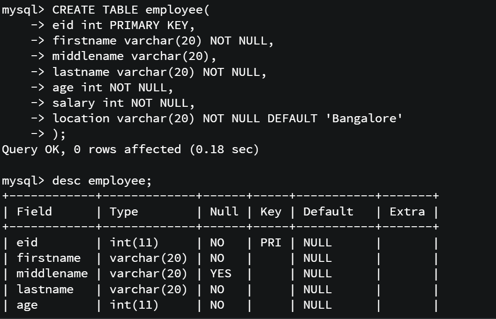

      <h4 id = "3.1.1">Auto-Increment:</h4>
       Ans:  Since primary keys mostly correspond to IDs, it is set to auto-increment while creating the database to free the pain of identifying ids for every record and the primary key can then be ommitted from the sql code to insert a new record. The table auto-increments for every record.  

    > I did not provide eid here which is primary key and required. This is because I specified it to be auto incremented and hence is taken care of by the database.
    >
    > 
    >
    > The id gets automatically inserted below.
    >
    > 

    <h4 id = "3.1.2">Composite Primary Key</h4>
    Ans: This is used when we cannot figure out how to identify a record uniquely using only 1 attribute. Then, 1 or more attributes may be combined to make a primary key that will always be unique and not null. 

    The first and lastname combined form the primary key for this table.

    

    When I try entering the same first and lastname as before, it gives an error because a primary key cannot be repeated.

    

2.  <h3 id = "3.2">Unique Key</h3>
    Ans: Unique key as the name suggests can have only unique values. 
    Notice, the id marked as unique key allows NULL values which was not the case when it was declared as Primary Key.

    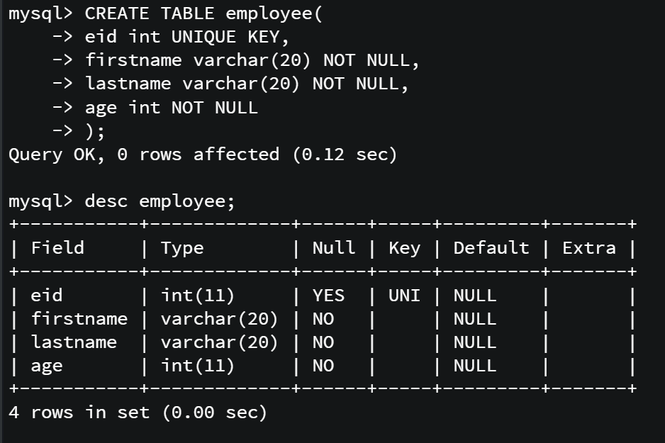

3.  <h3 id = "3.3">Difference between Primary Key and Unique Key:</h3>
    Ans: 

       <table>
         <thead>
            <tr>
               <th align="left">Primary Key</th>
               <th align="left">Unique Key</th>
            </tr>
         </thead>
         <tbody>
            <tr>
               <td align="left">There can be only 1 Primary Key.</td>
               <td align="left">There can be multiple Unique Keys.</td>
            </tr>
            <tr>
               <td align="left">Primary Key cannot be NULL.</td>
               <td align="left">Unique Keys can hold NULL.</td>
            </tr>
            <tr>
               <td align="left">Primary Keys uniquely identifies a record.</td>
               <td align="left">Unique Keys have no such funtionality.</td>
            </tr>
          </tbody>
        </table>
     

4.  <h3 id = "3.4">Relationship between Unique Key and NULL:</h3>
    Ans: This relation varies from DB to DB. In MySql, if a column is marked as unique key, it will take any number of NULL values. However, in some other DBs, it may happen that it takes only 1 NULL value.

    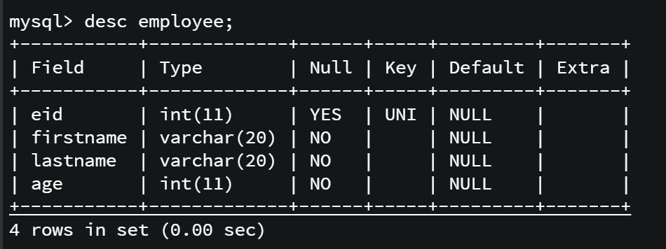

    When I try inserting 2 NULL eids, it will still work, because this is MySql.

    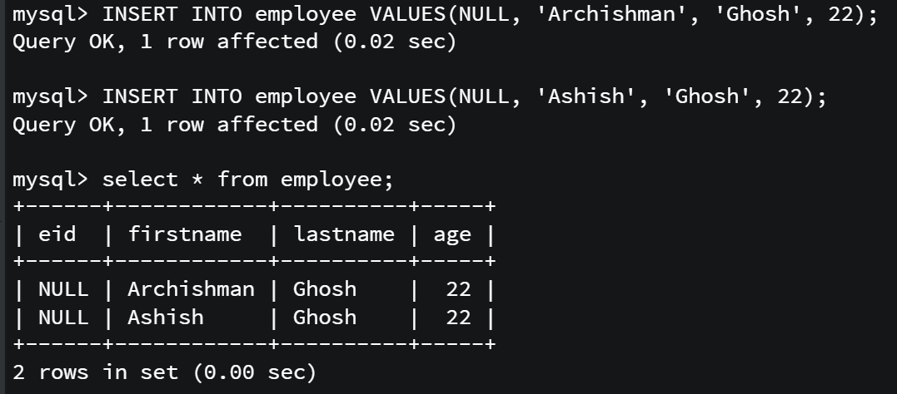

    However, on trying similar non-NULL values, it will give an error which should be obvious for all databases.

    

<h2 id = "4"> Session 4 </h2>

1. <h3 id = "4.1">Select statements:</h3>

   - <h4 id = "4.1.1">Selecting * from [table name]:</h4>
     This command shows all records across all rows and columns of the table.

     

   - <h4 id = "4.1.2">Selecting [column1 ... columnN] from [table name]:</h4>
     This command shows all rows across the specified N columns only.

     

   - <h4 id = "4.1.3">Selecting [* / [column1 ... columnN]] from [table name] where [conditional clause]:</h4>
     This command shows only rows which statisfy the condition across columns specified.

     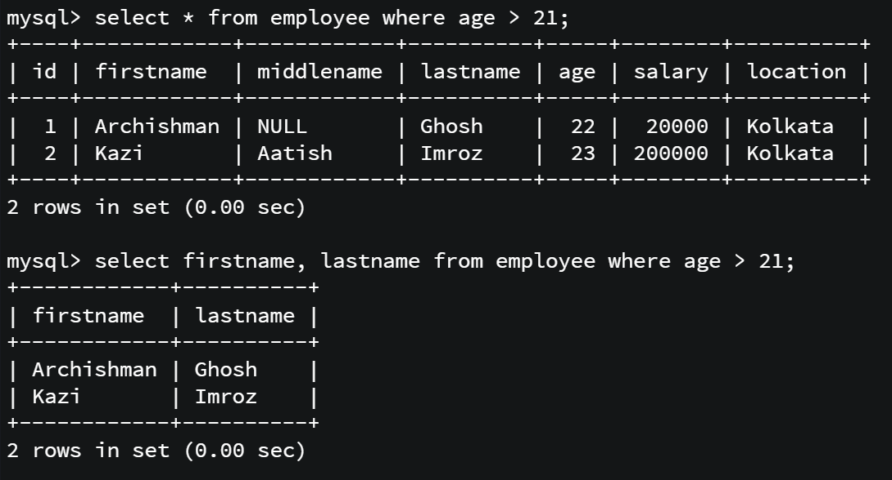

     - <h4 id = "4.1.3.1">Case Sensitivity of where clause (Binary Keyword):</h4>
       By default, where is case-insensitive but on specifying a keyword called binary, it can be made case-sensitive.

       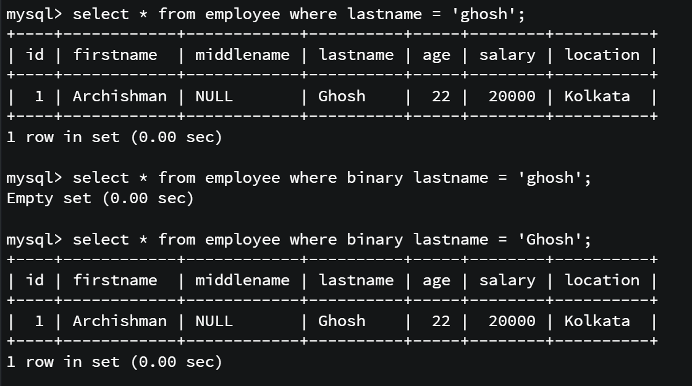

   - <h4 id = "4.1.4">'as' keyword:</h4>
      This keyword is used in case we want to have the columns have a different name when displayed, than the one in the database. This is also known as displaying as an alias.

     

2. <h3 id = "4.2">Update statements:</h3>

   - <h4 id = "4.2.1">Update [table name] set [column name] = [new value] where [column name] = [value]:</h4>
     This updates the value of the specified column name value where the conditional clause matches.

     

   - <h4 id = "4.2.2">Update [table name] set [column name] = [new value]:</h4>
     Omitting the where clause will update all rows with the new value.

     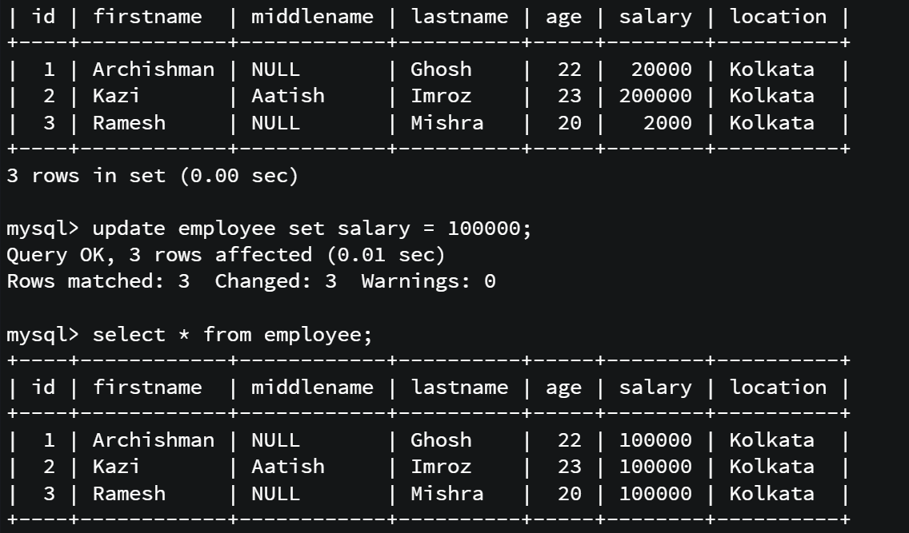

   - <h4 id = "4.2.3">Update [table name] set [column name] = [column name] + [new value]:</h4>
     This will update the previous record by adding the new value.

   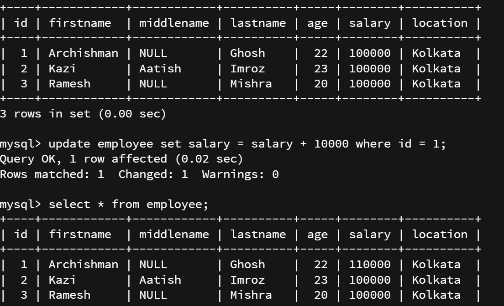

3. <h3 id = "4.3">Delete statements:</h3>

   - <h4 id = "4.3.1">Delete from [table name] where [condition clause]:</h4>
     This deletes all rows which match the condition clause.

     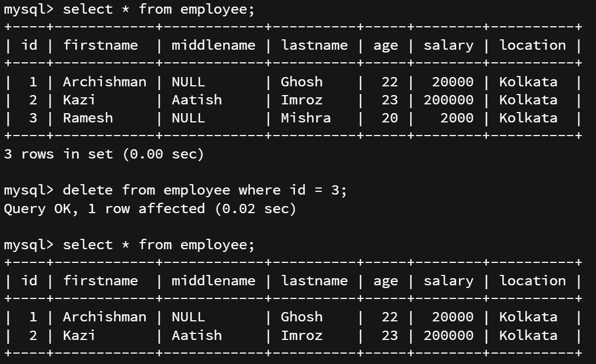

   - <h4 id = "4.3.2">Delete from [table name]:</h4>
     This will delete all record from the table. 
     !important: __If records are deleted and the column is set to be auto incremented, the column's value will start from where it ended and not from 1 again.__

   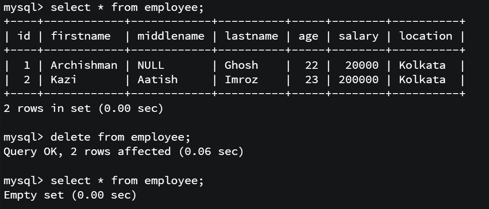

4. <h3 id = "4.4">Alter statements:</h3>

   - <h4 id = "4.4.1">Alter table [table name] add column [column name][datatype]:</h4>
     This adds a new column with the specified datatype.

     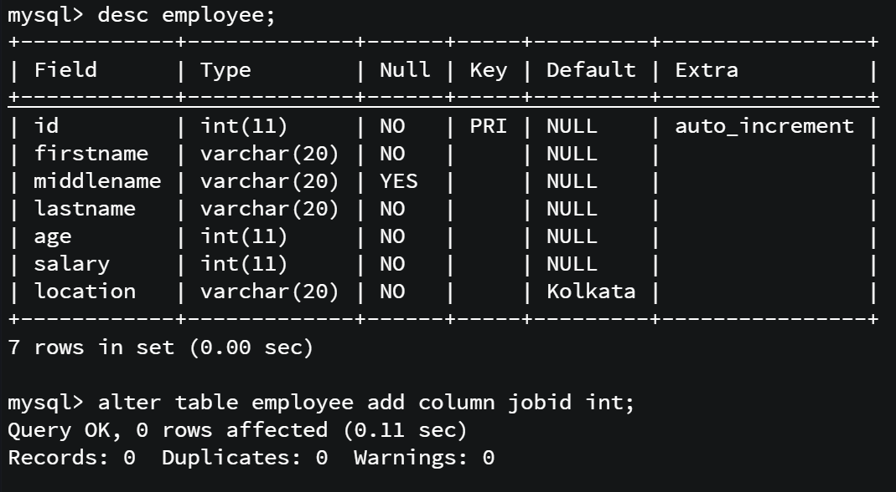

     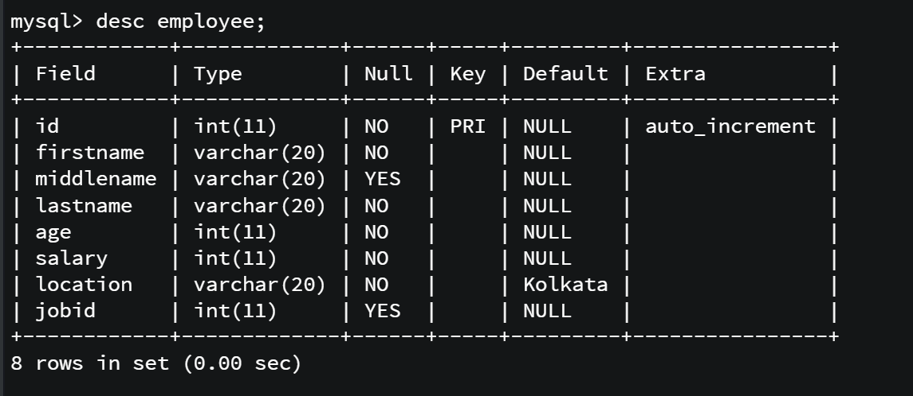

   - <h4 id = "4.4.2">Alter table [table name] drop column [column name]:</h4>
     This drops the specified column.

     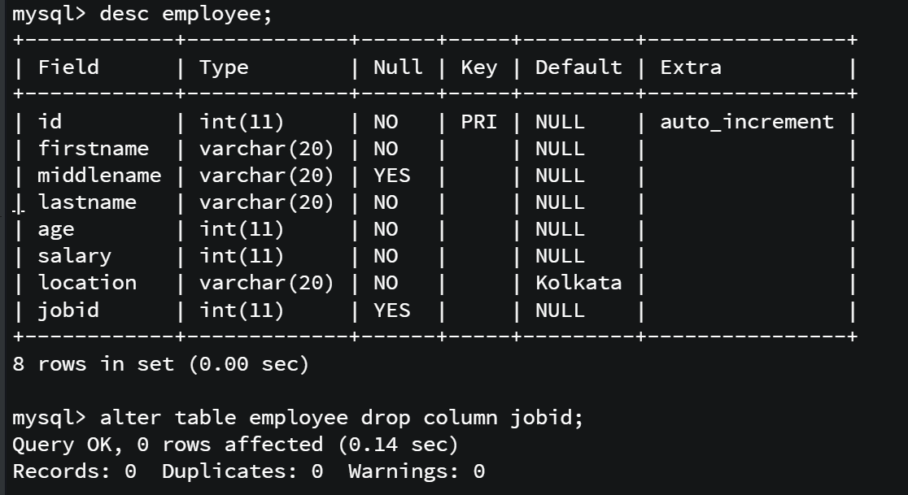

     

   - <h4 id = "4.4.3">Alter table [table name] modify column [column name] [new datatype]:</h4>
     This changes the datatype of the specified column to the new datatype.

     

   - <h4 id = "4.4.4">Alter table [table name] drop primary key:</h4>
      Drops the primary key of the table.

     

     

   - <h4 id = "4.4.5">Alter table [table name] add primary key(column name):</h4>
     Adds the specified column as the primary key of the table.

     

     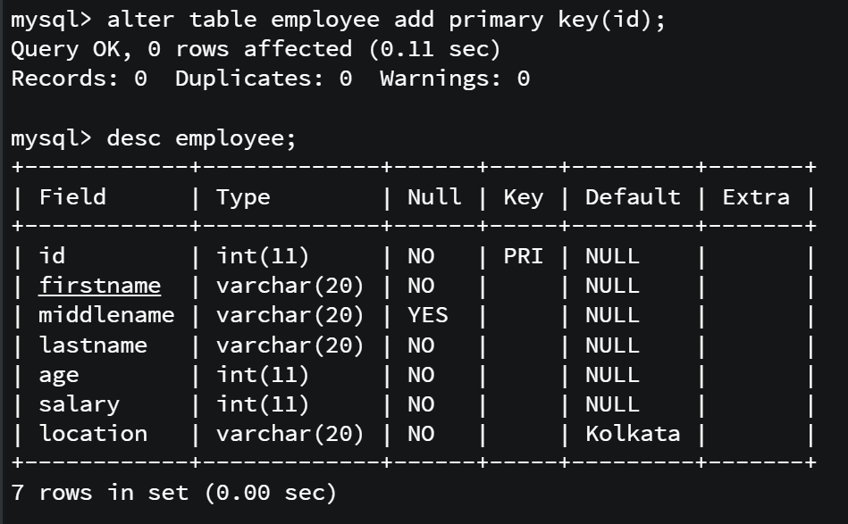

5. <h3 id = "4.5">DDL vs DML:</h3>
   

     <table>
       <thead>
           <tr>
             <th align="left">DDL</th>
             <th align="left">DML</th>
           </tr>
       </thead>
       <tbody>
           <tr>
             <td align="left">Stands for Data Definition Language.</td>
             <td align="left">Stands for Data Manipulation Language.</td>
           </tr>
           <tr>
             <td align="left">This deals with the structure or schema of the table.</td>
             <td align="left">This deals with the actual data of the table.</td>
           </tr>
           <tr>
             <td align="left">Create, Alter, Drop are some of the DDL commands.</td>
             <td align="left">Insert, Update, Delete are some of the DML commands.</td>
           </tr>
         </tbody>
       </table>
   

6. <h3 id = "4.6">Truncate vs Delete:</h3>

   

     <table>
       <thead>
           <tr>
             <th align="left">Truncate</th>
             <th align="left">Delete</th>
           </tr>
       </thead>
       <tbody>
           <tr>
             <td align="left">Truncate is a DDL command.</td>
             <td align="left">Delete is a DML command.</td>
           </tr>
           <tr>
             <td align="left">This drops the table and re-creates it, resulting in deletion of all records.</td>
             <td align="left">This deletes each record one by one till no records remain.</td>
           </tr>
           <tr>
             <td align="left">For a large table with loads of data, truncate is much more efficient than delete as it drops the whole table at once.</td>
             <td align="left">This is very slow for large volumes of data as it deletes each record one by one.</td>
           </tr>
         </tbody>
       </table>
   

7. <h3 id = "4.7">Update vs Alter:</h3>
    

     <table>
       <thead>
           <tr>
             <th align="left">Update</th>
             <th align="left">Alter</th>
           </tr>
       </thead>
       <tbody>
           <tr>
             <td align="left">This changes the actual data in the table.</td>
             <td align="left">This changes the schema/structure of the table.</td>
           </tr>
         </tbody>
       </table>
   

