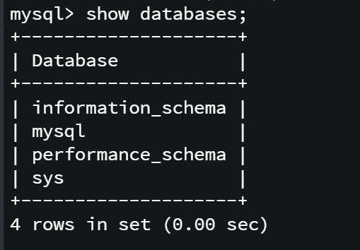
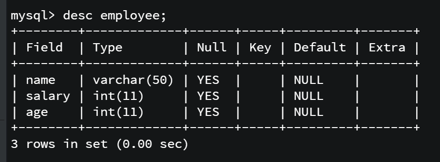

# List of Contents:

- <a href = "#1">Session 1:</a> 
  - <a href = "#1.1">Database</a>
  - <a href = "#1.2">Table</a>
  - <a href = "#1.3">Types of Databases</a>
    - <a href = "#1.3.1">Relational Databases</a>
    - <a href = "#1.3.2">NoSQL Databases</a>
  - <a href = "#1.4">SQL</a>
  - <a href = "#1.5">MySQL vs SQL</a>
  - <a href = "#1.6">Installation of MySQL</a>
    - <a href = "#1.6.1">Global Usage</a>
  - <a href = "#1.7">SQL commands</a>
    - <a href = "#1.7.1">Show DB</a>
    - <a href = "#1.7.2">Drop DB</a>
    - <a href = "#1.7.3">Use DB</a>
    - <a href = "#1.7.4">Select DB</a>
    - <a href = "#1.7.5">Create Table</a>
    - <a href = "#1.7.6">Show Table</a>
    - <a href = "#1.7.7">Describe Table</a>
    - <a href = "#1.7.8">Drop Table</a>

<h2 id = "1"> Session 1 </h2>

1. <h3 id = "1.1">Database</h3> 
   Ans: A collection of data and holds this data in form of tables.  

2. <h3 id = "1.2">Table</h3> 
   Ans: It holds the data in form of rows and columns, similar to a spreadsheet. 
   <h4>Why not use a spreadsheet then?</h4> 
   Ans: The database provides us the capability to access and modify the data.  

3. <h3 id = "1.3">Different types of Databases</h3> 
   Ans: 2 types of databases: 

- <h4 id = "1.3.1"> Relational Databases </h4>: Rows and Columns and also tables have relation between them. Example: `MySQL`, `SQL Server`, `PostgreSQL`, `SQLite`, `MariaDB`. 
- <h4 id = "1.3.2"> NoSQL Databases </h4>: Key Value, Document, Graphs. Doesn't have any specified structure and different structures are non-relational. Example: `Hbase`, `Mongodb`, `Cassandra`.  

4. <h3 id = "1.4">SQL</h3> 
   Ans: Stands for Structured Query Language and is used to query a relational database.  

5. <h3 id = "1.5">MySQL vs SQL</h3>  
   Ans: MySQL is a relational database and SQL is the language used to interact with the databases, which includes, MySQL. SQL is a common language across all RDBs and the syntax also remains same for 99% code and the rest can be managed easily.  

6. <h3 id = "1.6"> Installation of MySQL </h3> 
   Ans: There are 2 methods by which we can use MySQL, by using it globally or locally. Below are the 2 processes:  
   1. <h4 id = "1.6.1"> Global Usage: </h4> 

   - Go to [Goorm ide site](https://ide.goorm.io/)
   - Click on _Get Started_ and _Sign up_ using an account. (Preferably Google).
   - Now, you will be re-directed to a dashboard.
   - Click _New Container_. It will be somewhere at the top-right of the page, considering this blog hasn't become too old!
   - Fill up the name (My Sql for this process, preferably), set-up the region to the nearest one and change the stack to **node.js**.
   - At the bottom, there will be a section of _Additional module/package_: Check the 1st 2 options, _Install MySQL_ and _Enable mysql-ctl command_.
   - We are all set and click _Create_. This will take some time to finish.
   - After finishing, click on launch container.

   2. <h4 id = "1.6.2"> Local Usage: </h4> 

   - Will add this later.  

7. <h3 id = "1.7"> SQL commands </h3> 
   Ans: We start with the following commands: 

   - <h4 id = "1.7.1">SHOW DATABASES:</h4> This command shows all the available databases currently. 

     

   - <h4 id = "1.7.2">DROP DATABASE [database name]: </h4> This command drops the specified database. 

     

   - <h4 id = "1.7.3"> USE [database name]:</h4> This command changes the current database to the specified one. 

     

   - <h4 id = "1.7.4"> SELECT database():</h4> This command shows the current db that is under use. 

     

   - <h4 id = "1.7.5"> CREATE TABLE [table name]([column name] [datatype], [], ...):</h4> This command creates a new table with the specified attributes. 

     

   - <h4 id = "1.7.6"> SHOW TABLES:</h4> This command shows all the tables present in the current database. 

     

   - <h4 id = "1.7.7"> DESC [table name]:</h4> This command describes the specified table name. 

     

   - <h4 id = "1.7.8"> DROP TABLE [table name]:</h4> This command drops the mentioned table from the current database. 

     

<h2 id = "2"> Session 2 </h2>

1. <h3 id = "2.1">CRUD Operations</h3> 
   Ans: CRUD stands for:

   - Create: insert statements
   - Read: select statements
   - Update: update statements
   - Delete: delete statements

2. <h3 id = "2.2">Basic SQL Commands:</h3> 

- <h4 id = "2.2.1"> INSERT INTO [table name] [columns list] VALUES [Value for every corresponding column] :</h4> This command inserts value inside the specified table for the specified columns. 

  

  

- <h4 id = "2.2.2"> NOT NULL :</h4> This command will specify that the value of the mentioned attribute can never be NULL. If a prompt is given with a NULL value, it will give an error. 

  

- <h4 id = "2.2.3"> DEFAULT [value] :</h4> This command specifies the default value for an attribute. If no value is given, the default value will be considered. 

  
